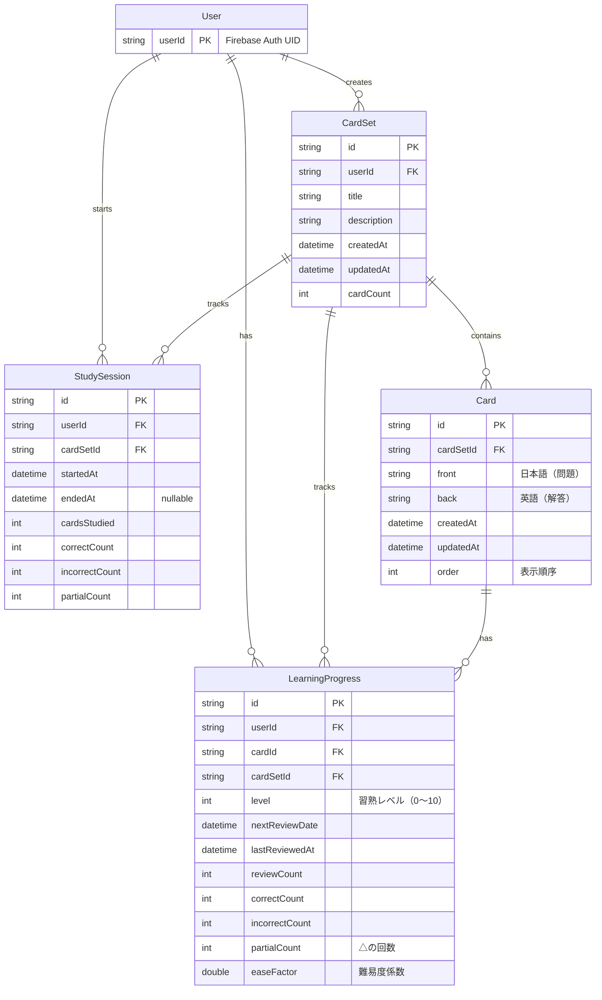

# RecallPro - ER図

## エンティティ関連図（Entity Relationship Diagram）

```mermaid
erDiagram
    User ||--o{ CardSet : creates
    User ||--o{ LearningProgress : has
    User ||--o{ StudySession : starts
    CardSet ||--o{ Card : contains
    CardSet ||--o{ LearningProgress : tracks
    CardSet ||--o{ StudySession : tracks
    Card ||--o{ LearningProgress : has

    User {
        string userId PK "Firebase Auth UID"
    }

    CardSet {
        string id PK
        string userId FK
        string title
        string description
        datetime createdAt
        datetime updatedAt
        int cardCount
    }

    Card {
        string id PK
        string cardSetId FK
        string front "日本語（問題）"
        string back "英語（解答）"
        datetime createdAt
        datetime updatedAt
        int order "表示順序"
    }

    LearningProgress {
        string id PK
        string userId FK
        string cardId FK
        string cardSetId FK
        int level "習熟レベル（0〜10）"
        datetime nextReviewDate
        datetime lastReviewedAt
        int reviewCount
        int correctCount
        int incorrectCount
        int partialCount "△の回数"
        double easeFactor "難易度係数"
    }

    StudySession {
        string id PK
        string userId FK
        string cardSetId FK
        datetime startedAt
        datetime endedAt "nullable"
        int cardsStudied
        int correctCount
        int incorrectCount
        int partialCount
    }
```
